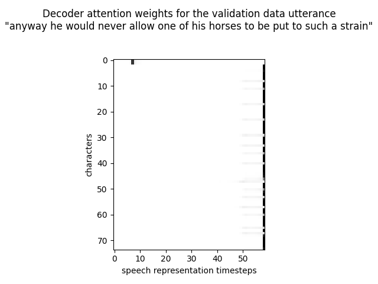
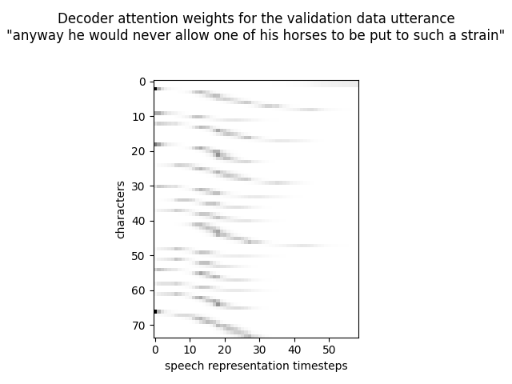
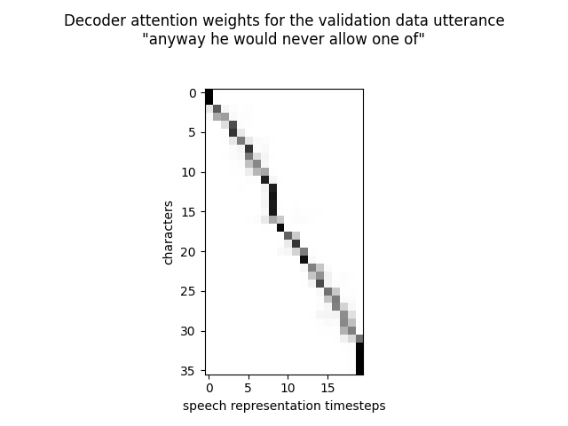

# Listen Attend Spell Variations

<b>Research</b>

I explored several variations of my <a href=https://github.com/redonovan/Listen-Attend-Spell>Listen Attend Spell</a> implementation in an effort to improve its performance, especially its attendance to the acoustics.  

<b> Attention Logit Scaling </b>

Analysis showed that my implementation had learned to put all its attention on one acoustic timestep early in training, from which it never recovered.  Reasoning that the one-hot nature of the softmax outputs meant that the logits were too large I decided to introduce 1/sqrt(model_dim) attention logit scaling as used in Transformers.  With this change the first two characters maintained attention ambiguity for the first 7 epochs of training and space characters began to attend more widely from epochs 9-10.  This plot shows the attention weights after 11 epochs (8 hours) of training:

Validation accuracy with this system was similar at 55.2% but decoded text lengths were more appropriate.

<b> Monotonicity Loss </b>

It has been noted before that while language translation tasks benefit from the ability of attention mechanisms to jump back and forth in time, in speech tasks we would prefer a more monotonic advancement in attention.  Reasoning that the system might find it easier to learn to move its attention focus slowly forward if given an explicit time reference, I first introduced a positional encoding embedding as used in Transformers, and when that didn't help I added a new monotonicity loss to encourage the desired behaviour.  Experiment suggested that a strong penalty on non-monotonic behaviour did not help, and I reason that it may actually impede learning; if the system attends too late with the 1st character a strong penalty prevents it from learning to attend correctly to later characters.  The system I used therefore gives a small, capped, penalty for moving attention focus backwards, and an equal small, capped, reward for moving attention focus forwards.  Applied from the start of training this scheme quickly leads to the attention weights fanning out from the top left of the attention plots.  However it also makes it more difficult for the system to escape the 18% training data accuracy plateau that all training runs seem to hit (where spaces are being spelled correctly, but nothing else).  Waiting until the end of the 1st epoch before applying the monotonicity loss works well, however, with both training and validation accuracy continuing to climb, and the final attention weights looking like:

This system achieved a validation accuracy of 54.5% after 9 epochs of training (~8 hours).

<b> Curriculum Learning </b>

A major difference between the speech dataset used in the <a href=https://arxiv.org/abs/1508.01211>paper</a> and <a href=https://www.openslr.org/12>LibriSpeech</a> is the length distribution over utterances.  Figure 4 in the paper shows that the mode of their length distribution was just 3 words, whereas in LibriSpeech it is closer to 37.  Reasoning that attention might be easier to learn from short sentences I tried a curriculum learning strategy in which I slowly increased the sentence length of training utterances over time.  Unfortunately LibriSpeech contains so few short sentences that the only noticeable effect was to overfit to the short training data.

I finally got my LAS system to attend to the acoustics by using <a href=http://kaldi-asr.org>Kaldi</a> to train hidden Markov models on the LibriSpeech data, and then using these HMMs to produce alignments for every word in the LibriSpeech transcriptions.  I then trained the LAS model using a curriculum learning strategy.  I began by choosing one word at random from each LibriSpeech transcription and training the system to associate the spelling of that word with the corresponding waveform samples.  This was repeated for 10 epochs of train-clean-100, with new random words chosen each epoch to ensure the system was trained on as much speech as possible.  After 10 epochs I moved to using 2 consecutive words instead of 1, thus introducing space as a new character to the system.  Each 10 epochs I moved to longer training segments, stopping after training on 7-word segments.  Validation used the first 7 words in each dev-clean utterance throughout the training process.  7 was chosen somewhat arbitrarily from Figure 4 in the LAS paper as the point of (approximate) lowest word error rate for their system; I have not explored longer segments at this time.  Positional encoding was found to be slightly helpful, and was included; monotonicity loss was found to be slightly unhelpful, and was not.

The system was trained for 5 hours.  It achieved a 93.2% character accuracy rate on validation data when (mostly) teacher-forcing the previous character.

Example of next character prediction when teacher forcing the previous character:

<pre>
predicted : 'anywhy se would never lllow ane if$'
target    : 'anyway he would never allow one of$'
</pre>

Example of pure decoding, from logmels and the start-of-sentence token:

<pre>
decoded : 'anywhere she would never low one in$'
target  : 'anyway he would never allow one of$'
</pre>

Plotting the decoder-listener attention weights, when teacher forcing the previous character, we find:

My code, which includes Attention Logit Scaling, is in <a href=listenattendspellcurr.py>listenattendspellcurr.py</a>, and the TensorBoard training curves in <a href=TensorBoard.png>TensorBoard.png</a>.
